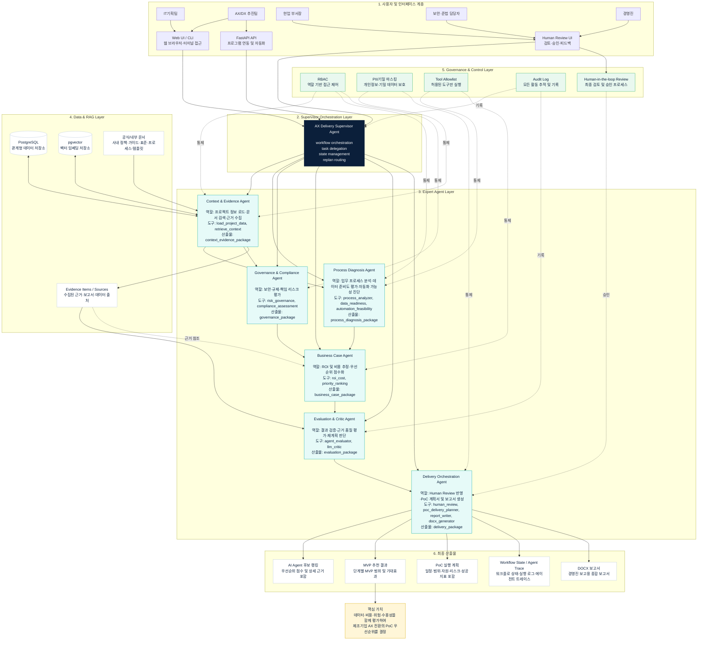
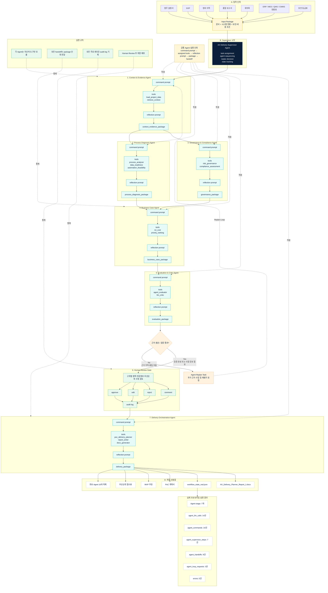

# AX Delivery Planner AI Agent 설계도

> Multi-Agent 기반 제조기업 AX 업무 진단 및 AI Agent 도입 우선순위 추천 시스템  
> 제출용 구성: **전체 시스템 아키텍처 다이어그램 + 업무 흐름도**

---

## 1. 전체 시스템 아키텍처 다이어그램

---

## 2. AI Agent 업무 흐름도

---

## 3. 제출용 사용 방법

Mermaid를 지원하는 Markdown 뷰어에서 열면 위 두 다이어그램이 자동 렌더링된다.

추천 사용 방식은 다음과 같다.

1. `VS Code`에서 Markdown Preview Mermaid Support 확장 설치
2. 이 `.md` 파일 열기
3. Mermaid Preview 또는 Markdown Preview로 확인
4. 필요 시 PDF로 인쇄 또는 캡처하여 발표자료/보고서에 삽입
