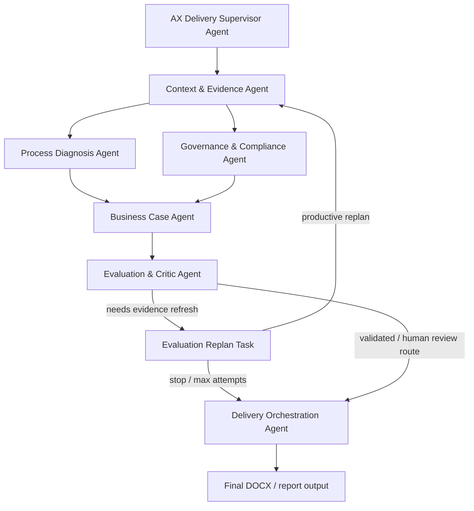

# Expert Agent Supervisor & Handoff Flow

The runtime uses Agent-stage nodes instead of bare LangGraph workflow nodes.

The top-level `AX Delivery Supervisor Agent` delegates work to lower Expert Agents. Each lower Agent receives its own LLM prompt, creates an execution command for its assigned internal nodes/tools, runs only that assigned work, reflects on the result through another LLM prompt, produces a package, and hands that package to the next Agent.

## Agent-stage graph



## Runtime structure

```text
AX Delivery Supervisor Agent
  -> delegates to one Expert Agent stage
  -> Expert Agent receives an LLM command prompt
  -> Expert Agent returns node_order, node_commands, tool focus, risk note, and handoff plan
  -> runtime executes only assigned internal nodes/tools
  -> Expert Agent receives an LLM reflection prompt over the observation
  -> Expert Agent decides handoff / iterate / replan / human_review / stop
  -> Expert Agent emits a package artifact
  -> Expert Agent hands off selected payload keys to downstream Agent
```

Current Agent-stage mapping in `app/graph/workflow.py`:

```text
context_evidence_agent
  - load_project_data
  - retrieve_context

process_diagnosis_agent
  - process_analyzer
  - data_readiness
  - automation_feasibility

governance_compliance_agent
  - risk_governance
  - compliance_assessment

business_case_agent
  - roi_cost
  - priority_ranking

evaluation_critic_agent
  - agent_evaluator
  - llm_critic

agent_replan
  - agent_replan

delivery_orchestration_agent
  - human_review
  - poc_delivery_planner
  - report_writer
  - docx_generator
```

## LLM-driven Agent loop

The Agent itself is the LLM prompt owner. There is no separate `llm_planner.py`.

For each Agent stage, the runtime calls:

```text
run_agent_command_prompt()
  -> role_prompt + task_instructions + assigned nodes/tools + incoming handoff + state summary
  -> JSON command: node_order, node_commands, handoff_plan, needs_iteration, risk_note

execute assigned internal nodes/tools

run_agent_reflection_prompt()
  -> original command + executed nodes + result summary + available output keys
  -> JSON decision: handoff, iterate, replan, human_review, or stop
```

The trace is stored in:

```text
agent_llm_calls
agent_commands
current_agent_command
current_agent_reflection
```

If the LLM call fails, the Agent stage falls back to deterministic execution and records `llm_used=false`. A valid run with a working vLLM endpoint should show `agent_llm_calls[*].llm_used=true` for the command/reflection prompts.

## Handoff packages

Each Agent stage writes one package artifact to state:

```text
context_evidence_package
process_diagnosis_package
governance_package
business_case_package
evaluation_package
delivery_package
```

The `agent_handoffs` trace records movement between Agents:

```json
{
  "from_agent": "context_evidence_agent",
  "to_agent": "process_diagnosis_agent",
  "source_stage": "context_evidence_agent",
  "source_nodes": ["load_project_data", "retrieve_context"],
  "target_nodes": ["process_analyzer", "data_readiness", "automation_feasibility"],
  "payload_keys": ["business_processes", "retrieved_contexts", "evidence_items"]
}
```

## Tool ownership

Tools are not global. They are assigned in `app/agents/registry.py` under each `AgentSpec.tool_specs`.

For example:

```text
Evaluation & Critic Agent
  internal node: agent_evaluator
  assigned tools:
    - evidence_quality_gate
    - review_status_calibrator
    - evidence_replan_decider
```

The stage-level Agent node may contain several internal nodes, but each internal node still calls only the tools assigned to its owning Expert Agent.

## Loop policy

Default loop cap:

```text
AGENT_SUPERVISOR_MAX_TOOL_LOOPS=2
```

A third loop is not automatic. It requires an explicit command:

```bash
python -m app.main --project-id <PROJECT_ID> --auto-approve --allow-agent-extra-loop
```

When the LLM reflection says another loop is needed but the cap has been reached, the runtime writes an item to `agent_loop_requests` and continues with the best available result.

## LLM usage

LLM calls now happen at two levels:

```text
Agent-stage command/reflection
  -> each Expert Agent receives a prompt and decides its own assigned-node execution plan and handoff decision

Specific LLM tools
  -> process_discovery_llm: source-grounded process discovery
  -> llm_critic: second-opinion review
  -> report_writer: report paragraph generation/rewrite
```

Final recommendation is still bounded by deterministic controls: assigned tool permissions, RAG evidence, score rules, Human Review, and loop limits.

## Runtime trace fields

Inspect these in `outputs/workflow_state_real.json`:

```json
{
  "agent_llm_calls": [
    {
      "kind": "agent_command",
      "agent_id": "business_case_agent",
      "stage_name": "business_case_agent",
      "llm_used": true,
      "mode": "expert_agent_llm_command",
      "node_order": ["roi_cost", "priority_ranking"],
      "handoff_plan": {
        "next_agent": "evaluation_critic_agent",
        "payload_keys": ["roi_cost", "priority_ranking"]
      }
    },
    {
      "kind": "agent_reflection",
      "agent_id": "business_case_agent",
      "stage_name": "business_case_agent",
      "llm_used": true,
      "mode": "expert_agent_llm_reflection",
      "decision": "handoff"
    }
  ],
  "agent_supervisor_steps": [
    {
      "supervisor_agent_id": "ax_delivery_supervisor_agent",
      "delegated_to": "business_case_agent",
      "delegated_stage": "business_case_agent",
      "delegated_nodes": ["roi_cost", "priority_ranking"],
      "input_keys": ["process_analysis", "data_readiness", "automation_feasibility", "risk_governance", "compliance_assessment"],
      "expected_output_keys": ["roi_cost", "priority_ranking"]
    }
  ],
  "agent_handoffs": [
    {
      "from_agent": "business_case_agent",
      "to_agent": "evaluation_critic_agent",
      "source_stage": "business_case_agent",
      "source_nodes": ["roi_cost", "priority_ranking"],
      "payload_keys": ["roi_cost", "priority_ranking"]
    }
  ],
  "business_case_package": {
    "agent_id": "business_case_agent",
    "produced_by": "business_case_agent",
    "executed_nodes": ["roi_cost", "priority_ranking"],
    "output_keys": ["roi_cost", "priority_ranking"]
  }
}
```

## CLI

Normal run:

```bash
python -m app.main --project-id 1 --auto-approve --verbose
```

Allow one explicit extra Agent loop:

```bash
python -m app.main --project-id 1 --auto-approve --allow-agent-extra-loop --verbose
```
