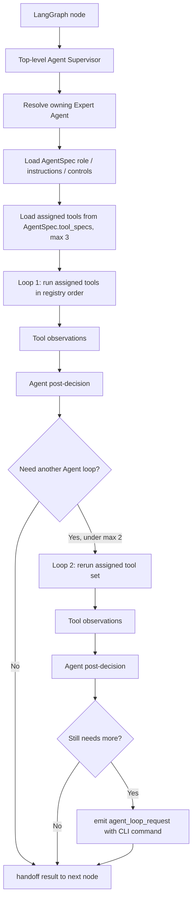

# Expert Agent Supervisor Loop

The runtime no longer uses a separate LLM planner to choose tools.

The structure is now:

```text
Top-level Agent Supervisor
  -> resolve owning Expert Agent
  -> load tools assigned to that Agent for the current node
  -> run the assigned tools in order
  -> apply the Agent's post-decision
  -> loop at most 2 times by default
  -> if more loop is needed, emit a command request and continue unless explicitly approved
```

## Runtime flow



## Loop policy

Default loop cap:

```text
AGENT_SUPERVISOR_MAX_TOOL_LOOPS=2
```

A third loop is not automatic. It requires an explicit command:

```bash
python -m app.main --project-id <PROJECT_ID> --auto-approve --allow-agent-extra-loop
```

When the system thinks another loop could help but the cap has been reached, it writes an item to `agent_loop_requests` and continues with the best available result.

## Agent-to-tool assignment

Tools are not global. They are assigned in `app/agents/registry.py` under each `AgentSpec.tool_specs`.

For example:

```text
Evaluation & Critic Agent
  node: agent_evaluator
  assigned tools:
    - evidence_quality_gate
    - review_status_calibrator
    - evidence_replan_decider
```

The Agent Supervisor does not allow that Agent to call tools outside its own assigned list. The selected/emphasized tool is still recorded, but the loop executes the assigned tool set so the trace shows how the Agent used its available tools.

## LLM usage

There is no separate `llm_planner.py` now.

LLM calls remain inside specific tools only:

```text
process_discovery_llm -> source-grounded process discovery
llm_critic           -> second-opinion review
report_writer        -> report paragraph generation/rewrite
```

All other tool calls are DB/RAG/rule/scoring/validation operations.

## Runtime trace fields

Inspect these in `outputs/workflow_state_real.json`:

```json
{
  "agent_contracts": [
    {
      "agent_id": "evaluation_critic_agent",
      "node_name": "agent_evaluator",
      "assigned_tools": [
        {"name": "evidence_quality_gate", "uses_llm": false},
        {"name": "review_status_calibrator", "uses_llm": false},
        {"name": "evidence_replan_decider", "uses_llm": false}
      ],
      "agent_loop_mode": "expert_agent_supervisor_loop",
      "loop_limit": 2
    }
  ],
  "agent_tool_calls": [
    {
      "agent_id": "evaluation_critic_agent",
      "node_name": "agent_evaluator",
      "loop_index": 1,
      "tool_name": "evidence_quality_gate",
      "executes_node": true,
      "planner_used_llm": false
    },
    {
      "agent_id": "evaluation_critic_agent",
      "node_name": "agent_evaluator",
      "loop_index": 1,
      "tool_name": "review_status_calibrator",
      "executes_node": false,
      "planner_used_llm": false
    }
  ],
  "agent_loop_iterations": [
    {
      "agent_id": "evaluation_critic_agent",
      "node_name": "agent_evaluator",
      "loop_index": 1,
      "assigned_tools_executed": [
        "evidence_quality_gate",
        "review_status_calibrator",
        "evidence_replan_decider"
      ]
    }
  ],
  "agent_loop_requests": [
    {
      "node_name": "agent_evaluator",
      "command": "python -m app.main --project-id 1 --auto-approve --allow-agent-extra-loop",
      "default_action": "skip_extra_loop_and_continue"
    }
  ]
}
```

## CLI

Normal run:

```bash
python -m app.main --project-id 1 --auto-approve --verbose
```

Allow one explicit extra Agent loop:

```bash
python -m app.main --project-id 1 --auto-approve --allow-agent-extra-loop --verbose
```
