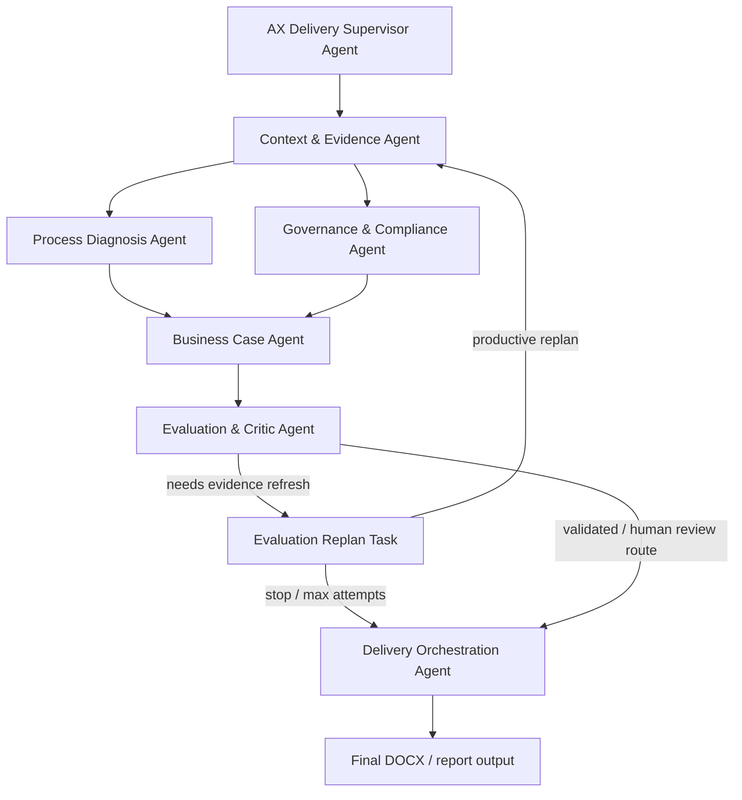

# Expert Agent Supervisor & Handoff Flow

The runtime uses Agent-stage nodes instead of bare LangGraph workflow nodes.

The top-level `AX Delivery Supervisor Agent` delegates work to lower Expert Agents. Each lower Agent runs only its assigned internal tool nodes, produces a package, and hands that package to the next Agent.

## Agent-stage graph



## Runtime structure

```text
AX Delivery Supervisor Agent
  -> delegates to one Expert Agent stage
  -> Expert Agent runs its assigned internal tool nodes
  -> Expert Agent applies post-decision rules and loop policy
  -> Expert Agent emits a package artifact
  -> Expert Agent hands off selected payload keys to downstream Agent
```

Current Agent-stage mapping in `app/graph/workflow.py`:

```text
context_evidence_agent
  - load_project_data
  - retrieve_context

process_diagnosis_agent
  - process_analyzer
  - data_readiness
  - automation_feasibility

governance_compliance_agent
  - risk_governance
  - compliance_assessment

business_case_agent
  - roi_cost
  - priority_ranking

evaluation_critic_agent
  - agent_evaluator
  - llm_critic

agent_replan
  - agent_replan

delivery_orchestration_agent
  - human_review
  - poc_delivery_planner
  - report_writer
  - docx_generator
```

## Handoff packages

Each Agent stage writes one package artifact to state:

```text
context_evidence_package
process_diagnosis_package
governance_package
business_case_package
evaluation_package
delivery_package
```

The `agent_handoffs` trace records movement between Agents:

```json
{
  "from_agent": "context_evidence_agent",
  "to_agent": "process_diagnosis_agent",
  "source_stage": "context_evidence_agent",
  "source_nodes": ["load_project_data", "retrieve_context"],
  "target_nodes": ["process_analyzer", "data_readiness", "automation_feasibility"],
  "payload_keys": ["business_processes", "retrieved_contexts", "evidence_items"]
}
```

## Tool ownership

Tools are not global. They are assigned in `app/agents/registry.py` under each `AgentSpec.tool_specs`.

For example:

```text
Evaluation & Critic Agent
  internal node: agent_evaluator
  assigned tools:
    - evidence_quality_gate
    - review_status_calibrator
    - evidence_replan_decider
```

The stage-level Agent node may contain several internal nodes, but each internal node still calls only the tools assigned to its owning Expert Agent.

## Loop policy

Default loop cap:

```text
AGENT_SUPERVISOR_MAX_TOOL_LOOPS=2
```

A third loop is not automatic. It requires an explicit command:

```bash
python -m app.main --project-id <PROJECT_ID> --auto-approve --allow-agent-extra-loop
```

When the system thinks another loop could help but the cap has been reached, it writes an item to `agent_loop_requests` and continues with the best available result.

## LLM usage

There is no separate `llm_planner.py`.

LLM calls remain inside specific tools only:

```text
process_discovery_llm -> source-grounded process discovery
llm_critic           -> second-opinion review
report_writer        -> report paragraph generation/rewrite
```

All other tool calls are DB/RAG/rule/scoring/validation operations.

## Runtime trace fields

Inspect these in `outputs/workflow_state_real.json`:

```json
{
  "agent_supervisor_steps": [
    {
      "supervisor_agent_id": "ax_delivery_supervisor_agent",
      "delegated_to": "business_case_agent",
      "delegated_stage": "business_case_agent",
      "delegated_nodes": ["roi_cost", "priority_ranking"],
      "input_keys": ["process_analysis", "data_readiness", "automation_feasibility", "risk_governance", "compliance_assessment"],
      "expected_output_keys": ["roi_cost", "priority_ranking"]
    }
  ],
  "agent_handoffs": [
    {
      "from_agent": "business_case_agent",
      "to_agent": "evaluation_critic_agent",
      "source_stage": "business_case_agent",
      "source_nodes": ["roi_cost", "priority_ranking"],
      "payload_keys": ["roi_cost", "priority_ranking"]
    }
  ],
  "business_case_package": {
    "agent_id": "business_case_agent",
    "produced_by": "business_case_agent",
    "executed_nodes": ["roi_cost", "priority_ranking"],
    "output_keys": ["roi_cost", "priority_ranking"]
  }
}
```

## CLI

Normal run:

```bash
python -m app.main --project-id 1 --auto-approve --verbose
```

Allow one explicit extra Agent loop:

```bash
python -m app.main --project-id 1 --auto-approve --allow-agent-extra-loop --verbose
```
