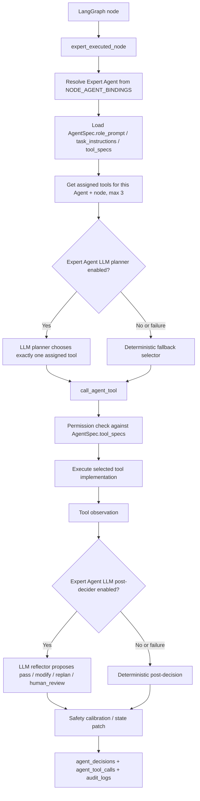
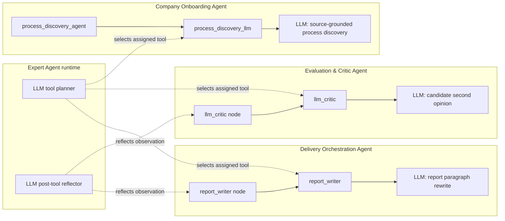

# Expert Agent Tool & LLM Flow

This document separates three concepts that were previously easy to mix up:

1. Expert Agent: responsibility owner with role prompt, task instructions, controls, and allowed tools.
2. Assigned Tool: a concrete tool spec in `AgentSpec.tool_specs` that the Agent may call.
3. LLM Call: only some tools or planner phases use the chat model.

## Runtime flow



## Where LLM is used



## Agent-to-tool assignment summary

| Expert Agent | LangGraph node | Assigned tools | LLM tool? |
|---|---|---|---|
| Company Onboarding Agent | `company_profile_agent` | `company_profile_loader`, `profile_evidence_validator` | No |
| Company Onboarding Agent | `source_ingestion_agent` | `official_source_ingestor`, `source_quality_filter` | No |
| Company Onboarding Agent | `process_discovery_agent` | `process_discovery_llm`, `discovery_fallback_planner` | Yes: `process_discovery_llm` |
| Context & Evidence Agent | `load_project_data` | `project_context_loader`, `context_completeness_checker` | No |
| Context & Evidence Agent | `retrieve_context` | `rag_retriever`, `evidence_gap_detector`, `source_deduplicator` | No |
| Process Diagnosis Agent | `process_analyzer` | `process_analyzer_tool`, `process_evidence_checker` | No |
| Process Diagnosis Agent | `data_readiness` | `data_readiness_scorer`, `data_gap_detector` | No |
| Process Diagnosis Agent | `automation_feasibility` | `automation_feasibility_scorer`, `automation_risk_filter` | No |
| Business Case Agent | `roi_cost` | `roi_calculator`, `roi_assumption_checker` | No |
| Business Case Agent | `priority_ranking` | `priority_ranker`, `ranking_policy_reviewer`, `candidate_status_calibrator` | No |
| Governance & Compliance Agent | `risk_governance` | `risk_rule_engine`, `sensitive_use_escalator` | No |
| Governance & Compliance Agent | `compliance_assessment` | `compliance_mapper`, `human_review_policy_mapper` | No |
| Evaluation & Critic Agent | `agent_evaluator` | `evidence_quality_gate`, `review_status_calibrator`, `evidence_replan_decider` | No |
| Evaluation & Critic Agent | `llm_critic` | `llm_critic`, `critic_replan_decider`, `critic_status_calibrator` | Yes: `llm_critic` |
| Evaluation & Critic Agent | `agent_replan` | `replan_router`, `replan_productivity_checker` | No |
| Delivery Orchestration Agent | `human_review` | `human_review_gate`, `review_decision_validator` | No |
| Delivery Orchestration Agent | `poc_delivery_planner` | `poc_planner`, `poc_candidate_guard`, `poc_kpi_checker` | No |
| Delivery Orchestration Agent | `report_writer` | `report_writer`, `citation_policy_reviewer`, `delivery_decision_summarizer` | Yes: `report_writer` |
| Delivery Orchestration Agent | `docx_generator` | `docx_exporter`, `docx_artifact_checker` | No |

## Runtime trace fields

After execution, inspect these fields in `workflow_state_real.json`:

```json
{
  "agent_tool_calls": [
    {
      "agent_id": "evaluation_critic_agent",
      "node_name": "llm_critic",
      "candidate_tools": ["llm_critic", "critic_replan_decider", "critic_status_calibrator"],
      "assigned_tools": [
        {"name": "llm_critic", "uses_llm": true},
        {"name": "critic_replan_decider", "uses_llm": false},
        {"name": "critic_status_calibrator", "uses_llm": false}
      ],
      "tool_name": "llm_critic",
      "tool_uses_llm": true,
      "planner_mode": "llm_agent_tool_planner",
      "planner_used_llm": true
    }
  ],
  "agent_decisions": [
    {
      "phase": "pre_tool_selection",
      "planner_mode": "llm_agent_tool_planner",
      "planner_used_llm": true,
      "selected_tool": "llm_critic",
      "selected_tool_uses_llm": true
    },
    {
      "phase": "post_tool_observation",
      "post_planner_mode": "llm_agent_post_decider",
      "post_planner_used_llm": true,
      "decision": "request_replan_or_human_review"
    }
  ]
}
```

If vLLM is unavailable or `AGENT_LLM_PLANNER_ENABLED=false`, the same fields remain present, but `planner_used_llm=false` and `planner_mode` records the fallback reason.
