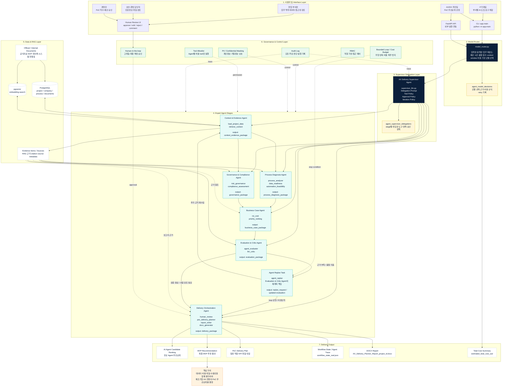
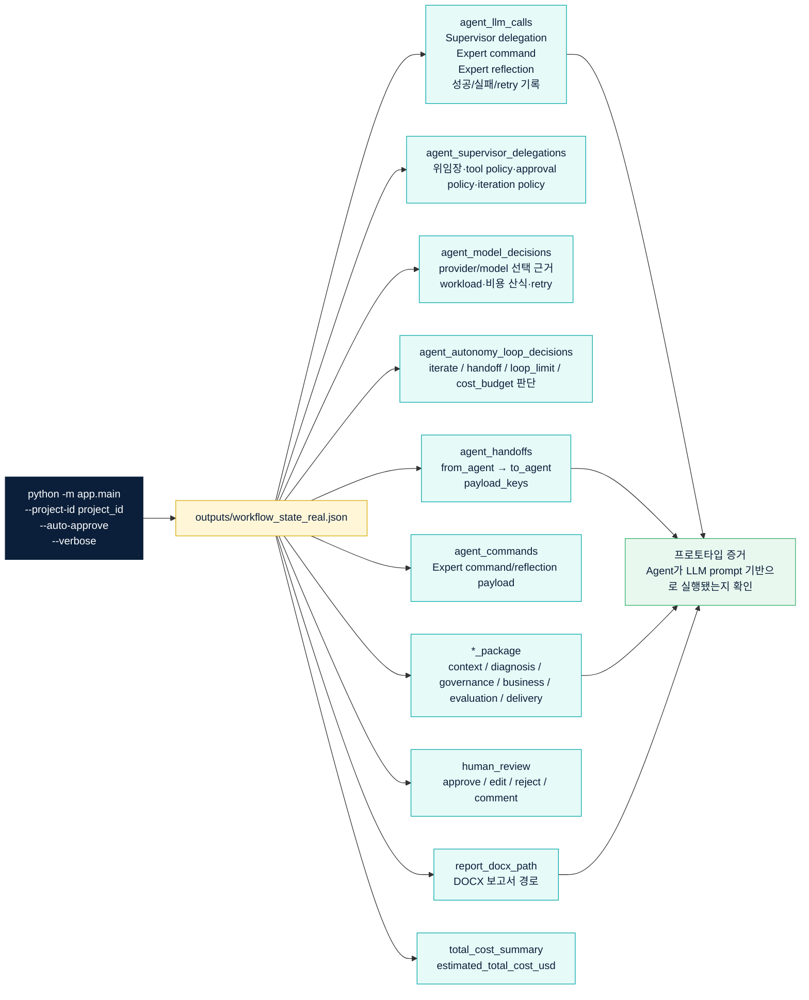

# AX Delivery Planner AI Agent 설계도

> 최신 README 기준 Mermaid 설계도  
> 구성: **전체 시스템 아키텍처 + AI Agent 업무 흐름도 + 실행 Trace 구조**

---

## 1. 전체 시스템 아키텍처



---

## 2. AI Agent 업무 흐름도

```mermaid
flowchart TD
    %% AX Delivery Planner - Business Workflow Diagram

    subgraph I["A. 입력 자료"]
        I1["업무 설명서"]
        I2["SOP / 작업표준서"]
        I3["회의록"]
        I4["정비 이력"]
        I5["품질 보고서"]
        I6["ERP / MES / QMS / CMMS 현황표"]
        I7["보안 등급표"]
        I8["인건비·시간 가정값"]
        IP["Input Package<br/>문서 + 시스템 현황 + 비용/보안 조건"]
    end

    I1 --> IP
    I2 --> IP
    I3 --> IP
    I4 --> IP
    I5 --> IP
    I6 --> IP
    I7 --> IP
    I8 --> IP

    START([Start]) --> IP
    IP --> ROUTE["Model Router<br/>호출별 provider/model 선택<br/>cost/performance trace 생성"]
    ROUTE --> SUP["AX Delivery Supervisor Agent<br/>Delegation Prompt 생성<br/>node_order / tool_policy / approval_policy / iteration_policy"]

    UNIT["Expert Agent 공통 실행 단위<br/>Supervisor delegation → Expert command prompt → assigned nodes/tools → Expert reflection prompt → Supervisor loop decision → package / handoff"]
    SUP -.공통 실행 원칙.-> UNIT

    subgraph ST1["1. Context & Evidence Agent"]
        C0["Supervisor delegation 수신"]
        C1["command prompt<br/>실행 순서·handoff 계획 생성"]
        C2["assigned tools<br/>load_project_data<br/>retrieve_context"]
        C3["reflection prompt<br/>근거 충분성·handoff 판단"]
        C4["Supervisor autonomy loop decision"]
        C5["context_evidence_package"]
    end

    SUP --> C0 --> C1 --> C2 --> C3 --> C4 --> C5

    subgraph ST2["2. Process Diagnosis Agent"]
        P1["command prompt"]
        P2["assigned tools<br/>process_analyzer<br/>data_readiness<br/>automation_feasibility"]
        P3["reflection prompt"]
        P4["Supervisor loop decision"]
        P5["process_diagnosis_package"]
    end

    subgraph ST3["3. Governance & Compliance Agent"]
        G1["command prompt"]
        G2["assigned tools<br/>risk_governance<br/>compliance_assessment"]
        G3["reflection prompt"]
        G4["Supervisor loop decision"]
        G5["governance_package"]
    end

    C5 --> P1
    C5 --> G1
    P1 --> P2 --> P3 --> P4 --> P5
    G1 --> G2 --> G3 --> G4 --> G5

    subgraph ST4["4. Business Case Agent"]
        B1["command prompt"]
        B2["assigned tools<br/>roi_cost<br/>priority_ranking"]
        B3["reflection prompt"]
        B4["Supervisor loop decision"]
        B5["business_case_package"]
    end

    P5 --> B1
    G5 --> B1
    B1 --> B2 --> B3 --> B4 --> B5

    subgraph ST5["5. Evaluation & Critic Agent"]
        E1["command prompt"]
        E2["assigned tools<br/>agent_evaluator<br/>llm_critic"]
        E3["reflection prompt<br/>handoff / iterate / replan / human_review 판단"]
        E4["Supervisor loop decision"]
        E5["evaluation_package"]
    end

    B5 --> E1 --> E2 --> E3 --> E4 --> E5

    DEC{"근거 충분 / 검증 통과?"}
    E5 --> DEC

    RP["Agent Replan Task<br/>agent_replan<br/>추가 근거 수집·재평가 경로 결정"]
    DEC -- "No<br/>evidence gap / weak confidence" --> RP
    RP -. "retrieve_context 재수집" .-> C1
    RP -- "loop limit / low productivity" --> HRG

    subgraph HR["6. Human Review Gate"]
        HRG["사람 검토 필요 항목<br/>고위험·민감정보·최종 확정·근거 부족"]
        H1["approve"]
        H2["edit"]
        H3["reject"]
        H4["comment"]
        H5["reviewer decision<br/>audit log 기록"]
    end

    DEC -- "Yes 또는 사람 검토 필요" --> HRG
    HRG --> H1
    HRG --> H2
    HRG --> H3
    HRG --> H4
    H1 --> H5
    H2 --> H5
    H3 --> H5
    H4 --> H5

    subgraph ST7["7. Delivery Orchestration Agent"]
        D1["command prompt"]
        D2["assigned tools<br/>human_review<br/>poc_delivery_planner<br/>report_writer<br/>docx_generator"]
        D3["reflection prompt"]
        D4["Supervisor loop decision"]
        D5["delivery_package"]
    end

    H5 --> D1 --> D2 --> D3 --> D4 --> D5

    F["Finalize Observability<br/>total_cost_summary 보강"]
    D5 --> F

    subgraph O["D. 최종 산출물"]
        O1["후보 Agent 10개 목록"]
        O2["우선순위 점수표"]
        O3["MVP 추천"]
        O4["PoC 계획서"]
        O5["workflow_state_real.json"]
        O6["AX_Delivery_Planner_Report_project_id.docx"]
        O7["total_cost_summary"]
    end

    F --> O1
    F --> O2
    F --> O3
    F --> O4
    F --> O5
    F --> O6
    F --> O7

    subgraph RULE["실행 규칙"]
        R1["각 Agent는 assigned node/tool만 실행"]
        R2["LLM이 허용되지 않은 node/tool을 요청하면 runtime에서 무시"]
        R3["모든 handoff는 package 단위 전달"]
        R4["Supervisor autonomy가 loop/cost/human boundary를 최종 판단"]
        R5["최종 업무 확정과 고위험 판단은 Human Review 대상"]
    end

    RULE -.적용.-> ST1
    RULE -.적용.-> ST2
    RULE -.적용.-> ST3
    RULE -.적용.-> ST4
    RULE -.적용.-> ST5
    RULE -.적용.-> ST7

    classDef navy fill:#0B1F3A,stroke:#0B1F3A,color:#FFFFFF,stroke-width:1px;
    classDef teal fill:#E6FAF8,stroke:#00A6A6,color:#0B1F3A,stroke-width:1px;
    classDef green fill:#E9F8EF,stroke:#2EAD68,color:#0B1F3A,stroke-width:1px;
    classDef orange fill:#FFF3E0,stroke:#F4A261,color:#0B1F3A,stroke-width:1px;
    classDef yellow fill:#FFF6D8,stroke:#D7A900,color:#0B1F3A,stroke-width:1px;
    classDef light fill:#FFFFFF,stroke:#B8C7D9,color:#0B1F3A,stroke-width:1px;

    class SUP,ROUTE navy;
    class UNIT,IP yellow;
    class C0,C1,C2,C3,C4,C5,P1,P2,P3,P4,P5,G1,G2,G3,G4,G5,B1,B2,B3,B4,B5,E1,E2,E3,E4,E5,D1,D2,D3,D4,D5 teal;
    class DEC,RP orange;
    class HRG,H1,H2,H3,H4,H5 green;
    class F light;
    class O1,O2,O3,O4,O5,O6,O7 light;
    class R1,R2,R3,R4,R5 green;
```



---

## 3. 실행 Trace 구조



---

## 4. Mermaid 렌더링 방법

VS Code 기준:

1. `Markdown Preview Mermaid Support` 확장 설치
2. 이 파일 열기
3. `Open Preview` 또는 `Markdown Preview` 실행
4. 다이어그램을 캡처하거나 PDF로 인쇄

CLI 기준:

```bash
npm install -g @mermaid-js/mermaid-cli
mmdc -i AX_Delivery_Planner_AI_Agent_설계도_mermaid.md -o ax_delivery_planner_diagram.pdf
```

Mermaid CLI에서 Markdown 전체 파일 변환이 불안정하면, 코드블록을 개별 `.mmd` 파일로 분리해 변환하면 된다.